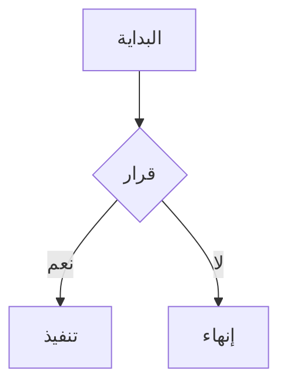

# تقرير المبيعات السنوي

هذا **مستند تجريبي** لاختبار عرض ملفات Markdown بالاتجاه من _اليمين إلى اليسار_، مع دعم كامل لكل الخصائص.

## الجداول

جدول بسيط بمحاذاة افتراضية:

| المنتج | الكمية | السعر | المجموع |
|--------|--------|-------|---------|
| حاسوب محمول | 15 | 3,200 | 48,000 |
| شاشة عرض | 42 | 850 | 35,700 |
| لوحة مفاتيح | 120 | 95 | 11,400 |

جدول بمحاذاة صريحة لكل عمود:

| يمين | وسط | يسار |
|-----:|:---:|:-----|
| القاهرة | 2024 | Cairo |
| الرياض | 2025 | Riyadh |
| بيروت | 2023 | Beirut |

جدول مختلط عربي/إنجليزي:

| Field | الوصف | Type |
|-------|-------|------|
| `user_id` | معرّف المستخدم الفريد | INT |
| `full_name` | الاسم الكامل للمستخدم | NVARCHAR(200) |
| `created_at` | تاريخ الإنشاء | DATETIME |

## القوائم

قائمة غير مرتبة:

- العنصر الأول
- العنصر الثاني
  - عنصر فرعي
  - عنصر فرعي آخر
- العنصر الثالث

قائمة مرتبة:

1. الخطوة الأولى
2. الخطوة الثانية
3. الخطوة الثالثة

قائمة مهام:

- [x] تصميم قاعدة البيانات
- [x] كتابة الواجهة
- [ ] الاختبار النهائي

## الاقتباسات

> هذا اقتباس عربي يجب أن يظهر الخط الجانبي فيه على اليمين.
>
> والسطر الثاني من الاقتباس.

## الكود

نص عربي يحتوي على كود مضمّن مثل `SELECT * FROM users` داخل الجملة.

```sql
SELECT u.full_name, COUNT(o.id) AS order_count
FROM users u
LEFT JOIN orders o ON o.user_id = u.id
GROUP BY u.full_name
ORDER BY order_count DESC;
```

```javascript
const مرحبا = "أهلاً بالعالم";
console.log(مرحبا);
```

## المعادلات

معادلة مضمّنة $E = mc^2$ داخل نص عربي.

معادلة مستقلة:

$$\sum_{i=1}^{n} x_i = \frac{n(n+1)}{2}$$

## المخططات



## عناصر أخرى

نص ~~محذوف~~ ونص ==مميز== ونص <ins>مُدرج</ins>.

الحواشي السفلية[^1] مدعومة أيضاً.

[^1]: هذا نص الحاشية السفلية.

اختصار لوحة المفاتيح: <kbd>Ctrl</kbd> + <kbd>S</kbd>

---

<details>
<summary>تفاصيل قابلة للطي</summary>

محتوى مخفي داخل عنصر details.

</details>

رابط [إلى موقع](https://example.com) ونص عادي بعده.
